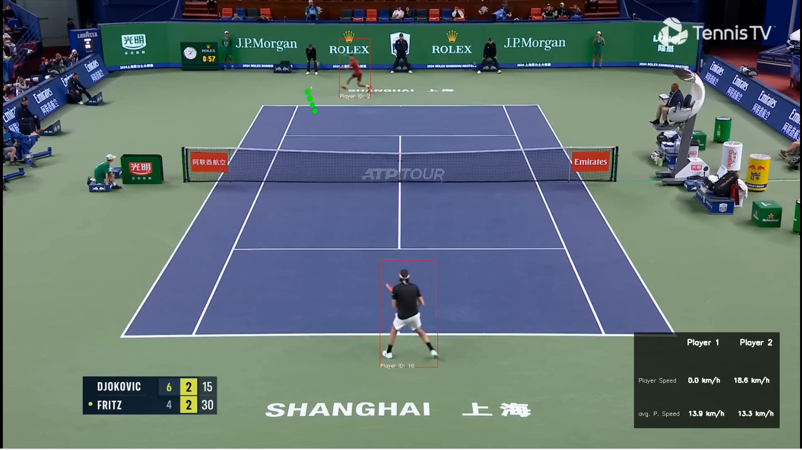

# 🎾 Tennis Analyst

An automated computer vision tool for analyzing tennis match footage. This project leverages state-of-the-art deep learning models to detect players and track the tennis ball in court videos, enabling advanced sports analytics.

## 🌟 Features

* **Player Detection:** Utilizes **YOLOv5su** (Ultralytics) for robust and real-time detection of tennis players on the court.
* **Ball Tracking:** Implements **TrackNet v1** to accurately track the high-speed, often blurred tennis ball across frames.
* **Match Analytics:** Computes player movement statistics including instantaneous speed and average speed throughout the match.
* **Video Annotation:** Outputs an annotated video with bounding boxes for players and trajectory lines for the ball.

## 🏗️ Model Architecture

### YOLOv5su

We use the updated `yolov5su` model from Ultralytics. It provides an excellent balance between inference speed and accuracy, making it ideal for tracking human figures in sports broadcasts.

### TrackNet v1

Tennis balls are notoriously difficult to track due to motion blur, occlusion, and small size. TrackNet v1 addresses this by taking consecutive frames as input to generate a heat map indicating the ball's location, effectively predicting the trajectory even when the ball is temporarily invisible.

## ⚙️ Installation

1. **Clone the repository:**
```bash
git clone https://github.com/Lad1411/Tennis-analyst.git
cd Tennis-analyst
```

2. **Create a virtual environment (optional but recommended):**

```bash
python -m venv venv
venv\Scripts\activate
```

3. **Install the dependencies:**
```bash
pip install -r requirements.txt
```

## 🚀 Usage
```bash
python main.py -i path/to/your/input_video.mp4 -o path/to/save/output_video.mp4
```

Example
```bash
python main.py -i input_video.mp4 -o output.mp4
```

## 🎥 Demo


